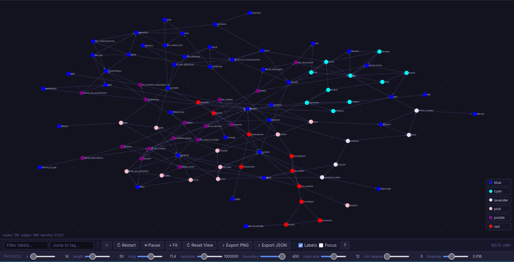

## Overview

Force Graph is an interactive, browser-based tool for exploring interconnected
knowledge as a force-directed graph. A lightweight Go server reads `.dm` files
that describe nodes and their connections, then serves the graph as JSON to a
vanilla JavaScript frontend that lays it out using Verlet integration physics.

The physics simulation uses a Barnes-Hut quadtree to approximate long-range
repulsion forces in O(n log n) time, making it practical for graphs with
hundreds of nodes. The simulation terminates automatically once the graph
settles, detected by a kinetic-energy threshold rather than a fixed frame cap.

Nodes are colored by a `tags:` field in each `.dm` file, allowing related nodes
to be grouped visually. Color groups can be toggled on and off with the chip
controls that appear alongside the graph.

  

## Features

- Force-directed layout using Verlet integration
- Barnes-Hut quadtree for efficient repulsion (O(n log n))
- Convergence-based simulation termination via kinetic energy threshold
- Node coloring by period/group tags with per-color visibility toggles
- Drag nodes, pan, and scroll-to-zoom
- Pin nodes in place with right-click
- Hover tooltip showing label and connection count
- Click a node to navigate to its graph
- Degree-based visibility filter to hide low-connectivity nodes
- Label filter with auto-fit to matching nodes
- Fullscreen mode
- Export graph as PNG or JSON
- `/tags` endpoint with autocomplete for the tag input
- Keyboard shortcuts for common actions

## Usage

## Keyboard Shortcuts

## Data Format

## Dependencies

## License

This work is licensed under the GNU General Public License version 3 (GPLv3).

